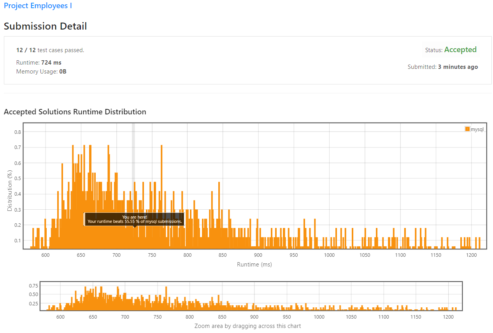

# Project Employees I

Table: `Project`
```
+-------------+---------+
| Column Name | Type    |
+-------------+---------+
| project_id  | int     |
| employee_id | int     |
+-------------+---------+
(project_id, employee_id) is the primary key of this table.
employee_id is a foreign key to Employee table.
```

Table: `Employee`
```
+------------------+---------+
| Column Name      | Type    |
+------------------+---------+
| employee_id      | int     |
| name             | varchar |
| experience_years | int     |
+------------------+---------+
employee_id is the primary key of this table.
```

Write an SQL query that reports the **average** experience years of all the employees for each project, **rounded to 2 digits**.

The query result format is in the following example:

```
Project table:
+-------------+-------------+
| project_id  | employee_id |
+-------------+-------------+
| 1           | 1           |
| 1           | 2           |
| 1           | 3           |
| 2           | 1           |
| 2           | 4           |
+-------------+-------------+

Employee table:
+-------------+--------+------------------+
| employee_id | name   | experience_years |
+-------------+--------+------------------+
| 1           | Khaled | 3                |
| 2           | Ali    | 2                |
| 3           | John   | 1                |
| 4           | Doe    | 2                |
+-------------+--------+------------------+

Result table:
+-------------+---------------+
| project_id  | average_years |
+-------------+---------------+
| 1           | 2.00          |
| 2           | 2.50          |
+-------------+---------------+
The average experience years for the first project is (3 + 2 + 1) / 3 = 2.00 and for the second project is (3 + 2) / 2 = 2.50

```

## My Solution
```sql
SELECT P.project_id, ROUND(AVG(E.experience_years),2) AS average_years
FROM Project P
LEFT JOIN Employee E 
ON P.employee_id = E.employee_id 
GROUP BY P.project_id
```

## My Submission


