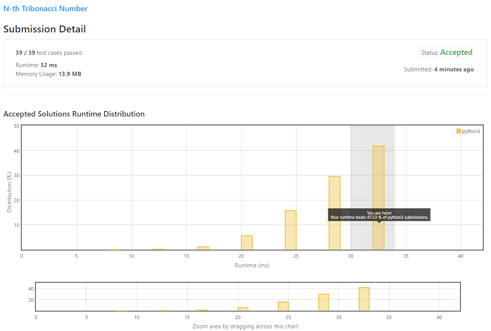

# N-th Tribonacci Number
The Tribonacci sequence `Tn` is defined as follows: 

`T0 = 0, T1 = 1, T2 = 1`, and `Tn+3 = Tn + Tn+1 + Tn+2` for `n >= 0`.

Given `n`, return the value of `Tn`.

 

**Example 1:**
```
Input: n = 4
Output: 4
Explanation:
T_3 = 0 + 1 + 1 = 2
T_4 = 1 + 1 + 2 = 4
```

**Example 2:**
```
Input: n = 25
Output: 1389537
``` 

**Constraints:**

* 0 <= n <= 37
* The answer is guaranteed to fit within a 32-bit integer, ie. answer <= 2<sup>31</sup> - 1.

## My Solution 
I used simple `Dynamic Programming`. 

```python
class Solution:
    def tribonacci(self, n: int) -> int:
        f = [0,1,1]
        
        if n <3:
            return f[n]
        
        for i in range(3,n+1): 
            f += [f[i-1]+f[i-2]+f[i-3]]
        
        return f[-1]
```

## My Submission 




