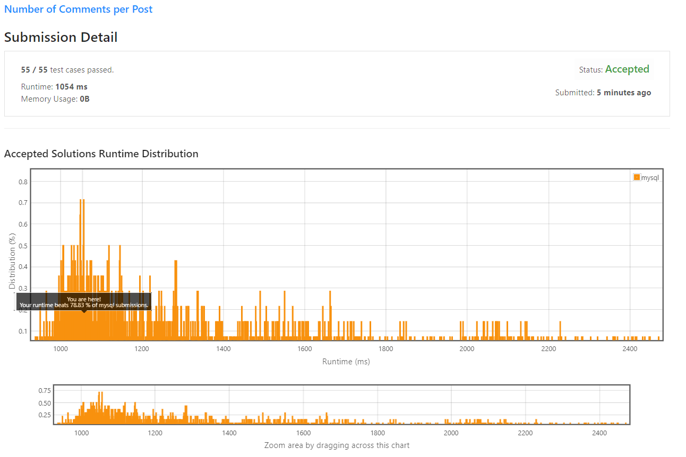

# Number of Comments per Post

Table: `Submissions`
```
+---------------+----------+
| Column Name   | Type     |
+---------------+----------+
| sub_id        | int      |
| parent_id     | int      |
+---------------+----------+
There is no primary key for this table, it may have duplicate rows.
Each row can be a post or comment on the post.
parent_id is null for posts.
parent_id for comments is sub_id for another post in the table.
```

Write an SQL query to find number of comments per each post.

Result table should contain `post_id` and its corresponding `number_of_comments`, and must be sorted by `post_id` in ascending order.

`Submissions` may contain duplicate comments. You should count the number of **unique comments** per post.

`Submissions` may contain duplicate posts. You should treat them as one post.

The query result format is in the following example:

```
Submissions table:
+---------+------------+
| sub_id  | parent_id  |
+---------+------------+
| 1       | Null       |
| 2       | Null       |
| 1       | Null       |
| 12      | Null       |
| 3       | 1          |
| 5       | 2          |
| 3       | 1          |
| 4       | 1          |
| 9       | 1          |
| 10      | 2          |
| 6       | 7          |
+---------+------------+

Result table:
+---------+--------------------+
| post_id | number_of_comments |
+---------+--------------------+
| 1       | 3                  |
| 2       | 2                  |
| 12      | 0                  |
+---------+--------------------+

The post with id 1 has three comments in the table with id 3, 4 and 9. The comment with id 3 is repeated in the table, we counted it only once.
The post with id 2 has two comments in the table with id 5 and 10.
The post with id 12 has no comments in the table.
The comment with id 6 is a comment on a deleted post with id 7 so we ignored it.
```

## My Solution 
1. I created query to get the unique posts 
2. I used `LEFT JOIN` to count number of comment for each post

Table `Unique_post`
```sql
SELECT DISTINCT sub_id AS post_id
    FROM Submissions
    WHERE parent_id IS NULL
```

```
+---------+
| post_id |
+---------+
|       1 |
|       2 |
|      12 |
+---------+
```

**Solution**
```sql
WITH u_post AS (
	SELECT DISTINCT sub_id AS post_id
    FROM Submissions
    WHERE parent_id IS NULL
)

SELECT UP.post_id, COUNT(DISTINCT S.sub_id) AS number_of_comments
FROM u_post AS UP
LEFT JOIN Submissions AS S
ON UP.post_id = S.parent_id
GROUP BY UP.post_id;
```

## My Submission 

