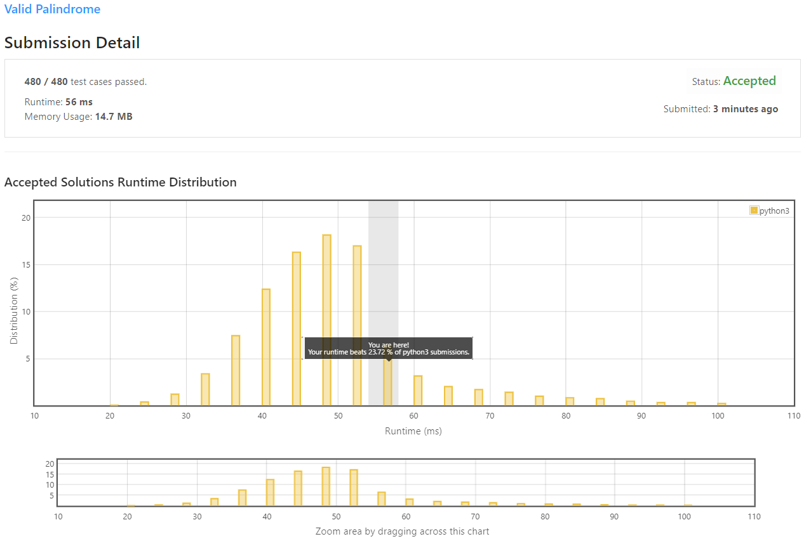

# Valid Palindrome

Given a string `s`, determine if it is a palindrome, considering only alphanumeric characters and ignoring cases.


**Example 1:**
```
Input: s = "A man, a plan, a canal: Panama"
Output: true
Explanation: "amanaplanacanalpanama" is a palindrome.
```

**Example 2:**
```
Input: s = "race a car"
Output: false
Explanation: "raceacar" is not a palindrome.
``` 

**Constraints:**

* 1 <= `s.length` <= 2 * 10<sup>5</sup>
* `s` consists only of printable **ASCII characters**.

## My Solution 
1. Clean the input
2. Check if it is a valid palindrome

```python
class Solution:
    def isPalindrome(self, s: str) -> bool:
        cleanstr = ""
        
        for i in s:
            if(i.islower() or i.isdigit() or i.isupper()):
                cleanstr+=i.lower()
        
        return cleanstr == cleanstr[::-1]
```

## My Submission 

