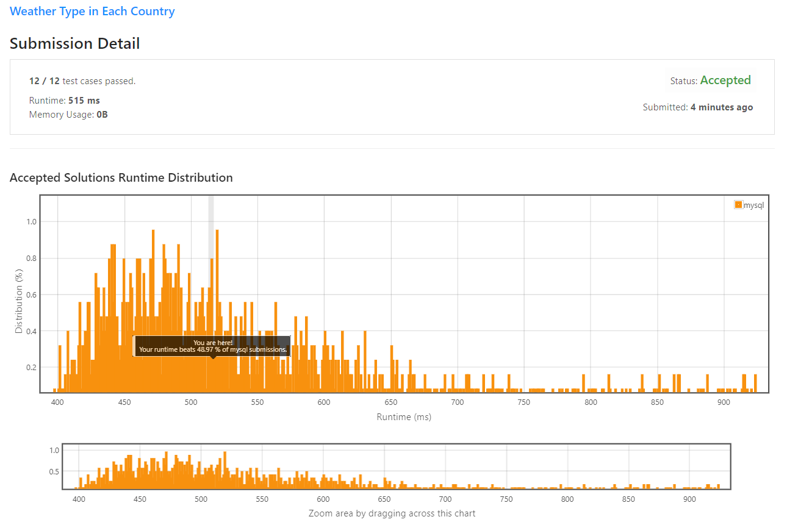

Table: `Countries`
```
+---------------+---------+
| Column Name   | Type    |
+---------------+---------+
| country_id    | int     |
| country_name  | varchar |
+---------------+---------+
country_id is the primary key for this table.
Each row of this table contains the ID and the name of one country.
```

Table: `Weather`
```
+---------------+---------+
| Column Name   | Type    |
+---------------+---------+
| country_id    | int     |
| weather_state | varchar |
| day           | date    |
+---------------+---------+
(country_id, day) is the primary key for this table.
Each row of this table indicates the weather state in a country for one day.
``` 

Write an SQL query to find the type of weather in each country for **November 2019**.

The type of weather is **Cold** if the **average** `weather_state` is `less than or equal 15`, **Hot** if the **average** `weather_state` is `greater than or equal 25` and **Warm** otherwise.

Return result table in any order.

The query result format is in the following example:
```
Countries table:
+------------+--------------+
| country_id | country_name |
+------------+--------------+
| 2          | USA          |
| 3          | Australia    |
| 7          | Peru         |
| 5          | China        |
| 8          | Morocco      |
| 9          | Spain        |
+------------+--------------+
Weather table:
+------------+---------------+------------+
| country_id | weather_state | day        |
+------------+---------------+------------+
| 2          | 15            | 2019-11-01 |
| 2          | 12            | 2019-10-28 |
| 2          | 12            | 2019-10-27 |
| 3          | -2            | 2019-11-10 |
| 3          | 0             | 2019-11-11 |
| 3          | 3             | 2019-11-12 |
| 5          | 16            | 2019-11-07 |
| 5          | 18            | 2019-11-09 |
| 5          | 21            | 2019-11-23 |
| 7          | 25            | 2019-11-28 |
| 7          | 22            | 2019-12-01 |
| 7          | 20            | 2019-12-02 |
| 8          | 25            | 2019-11-05 |
| 8          | 27            | 2019-11-15 |
| 8          | 31            | 2019-11-25 |
| 9          | 7             | 2019-10-23 |
| 9          | 3             | 2019-12-23 |
+------------+---------------+------------+
Result table:
+--------------+--------------+
| country_name | weather_type |
+--------------+--------------+
| USA          | Cold         |
| Austraila    | Cold         |
| Peru         | Hot          |
| China        | Warm         |
| Morocco      | Hot          |
+--------------+--------------+
Average weather_state in USA in November is (15) / 1 = 15 so weather type is Cold.
Average weather_state in Austraila in November is (-2 + 0 + 3) / 3 = 0.333 so weather type is Cold.
Average weather_state in Peru in November is (25) / 1 = 25 so weather type is Hot.
Average weather_state in China in November is (16 + 18 + 21) / 3 = 18.333 so weather type is Warm.
Average weather_state in Morocco in November is (25 + 27 + 31) / 3 = 27.667 so weather type is Hot.
We know nothing about average weather_state in Spain in November so we don't include it in the result table. 
```

## My Solution 

```sql
SELECT DISTINCT C.country_name, IF(AVG(W.weather_state) <= 15, "Cold",IF(AVG(W.weather_state) >= 25, "Hot","Warm")) AS weather_type
FROM Countries C 
LEFT JOIN Weather W
ON C.country_id = W.country_id
WHERE LEFT(W.day,7) = '2019-11'
GROUP BY c.country_name;
```

## My Submission 

