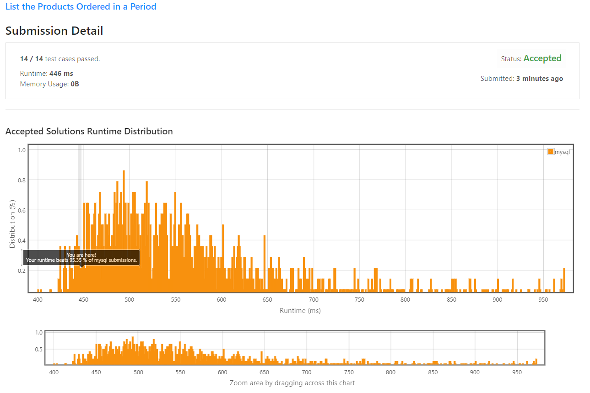

# List the Products Ordered in a Period

Table: `Products`
```
+------------------+---------+
| Column Name      | Type    |
+------------------+---------+
| product_id       | int     |
| product_name     | varchar |
| product_category | varchar |
+------------------+---------+
product_id is the primary key for this table.
This table contains data about the company's products.
```

Table: `Orders`
```
+---------------+---------+
| Column Name   | Type    |
+---------------+---------+
| product_id    | int     |
| order_date    | date    |
| unit          | int     |
+---------------+---------+
There is no primary key for this table. It may have duplicate rows.
product_id is a foreign key to Products table.
unit is the number of products ordered in order_date.
```

Write an SQL query to get the names of products with greater than or equal to 100 units ordered in February 2020 and their amount.

Return result table in any order.

The query result format is in the following example:


```
Products table:
+-------------+-----------------------+------------------+
| product_id  | product_name          | product_category |
+-------------+-----------------------+------------------+
| 1           | Leetcode Solutions    | Book             |
| 2           | Jewels of Stringology | Book             |
| 3           | HP                    | Laptop           |
| 4           | Lenovo                | Laptop           |
| 5           | Leetcode Kit          | T-shirt          |
+-------------+-----------------------+------------------+

Orders table:
+--------------+--------------+----------+
| product_id   | order_date   | unit     |
+--------------+--------------+----------+
| 1            | 2020-02-05   | 60       |
| 1            | 2020-02-10   | 70       |
| 2            | 2020-01-18   | 30       |
| 2            | 2020-02-11   | 80       |
| 3            | 2020-02-17   | 2        |
| 3            | 2020-02-24   | 3        |
| 4            | 2020-03-01   | 20       |
| 4            | 2020-03-04   | 30       |
| 4            | 2020-03-04   | 60       |
| 5            | 2020-02-25   | 50       |
| 5            | 2020-02-27   | 50       |
| 5            | 2020-03-01   | 50       |
+--------------+--------------+----------+

Result table:
+--------------------+---------+
| product_name       | unit    |
+--------------------+---------+
| Leetcode Solutions | 130     |
| Leetcode Kit       | 100     |
+--------------------+---------+

Products with product_id = 1 is ordered in February a total of (60 + 70) = 130.
Products with product_id = 2 is ordered in February a total of 80.
Products with product_id = 3 is ordered in February a total of (2 + 3) = 5.
Products with product_id = 4 was not ordered in February 2020.
Products with product_id = 5 is ordered in February a total of (50 + 50) = 100.
```

## My Solution 
 Straight forward, use `JOIN` 
```sql 
 SELECT P.product_name, SUM(O.unit) as unit
 FROM products P 
 JOIN Orders O 
 ON P.product_id = O.product_id
 WHERE LEFT(O.order_date,7) = '2020-02' 
 GROUP BY P.product_name
 HAVING unit >= 100;
```

## My submission 


