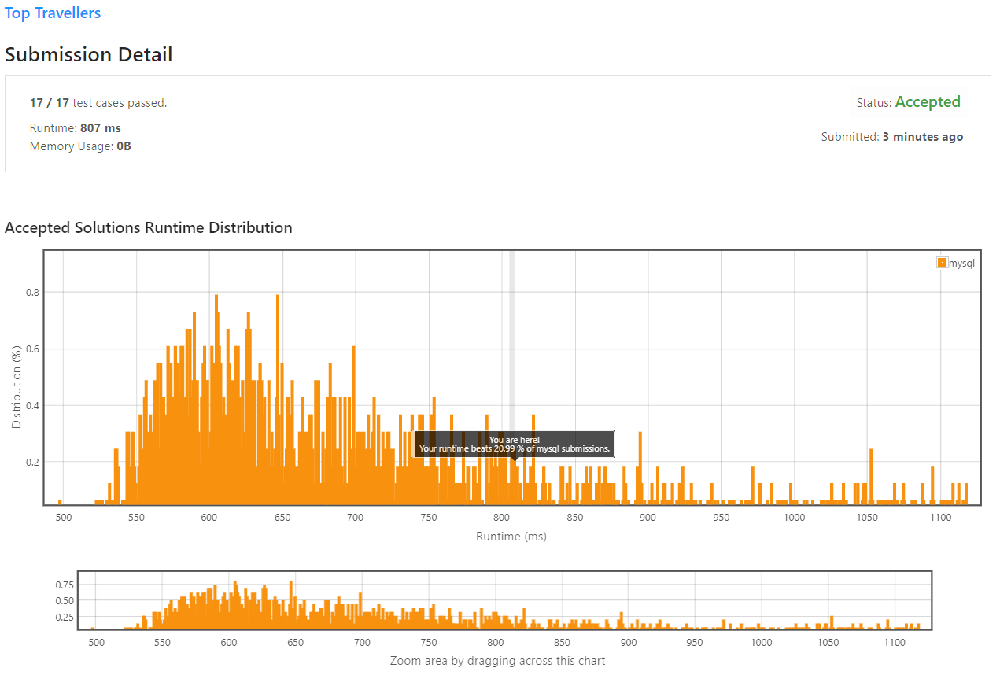

Table: `Users`
```
+---------------+---------+
| Column Name   | Type    |
+---------------+---------+
| id            | int     |
| name          | varchar |
+---------------+---------+
id is the primary key for this table.
name is the name of the user.
``` 

Table: `Rides`
```
+---------------+---------+
| Column Name   | Type    |
+---------------+---------+
| id            | int     |
| user_id       | int     |
| distance      | int     |
+---------------+---------+
id is the primary key for this table.
user_id is the id of the user who travelled the distance "distance".
```

Write an SQL query to report the distance travelled by each user.

Return the result table ordered by `travelled_distance` in **descending** order, if two or more users travelled the same distance, order them by their `name` in **ascending** order.

The query result format is in the following example.

```
Users table:
+------+-----------+
| id   | name      |
+------+-----------+
| 1    | Alice     |
| 2    | Bob       |
| 3    | Alex      |
| 4    | Donald    |
| 7    | Lee       |
| 13   | Jonathan  |
| 19   | Elvis     |
+------+-----------+

Rides table:
+------+----------+----------+
| id   | user_id  | distance |
+------+----------+----------+
| 1    | 1        | 120      |
| 2    | 2        | 317      |
| 3    | 3        | 222      |
| 4    | 7        | 100      |
| 5    | 13       | 312      |
| 6    | 19       | 50       |
| 7    | 7        | 120      |
| 8    | 19       | 400      |
| 9    | 7        | 230      |
+------+----------+----------+

Result table:
+----------+--------------------+
| name     | travelled_distance |
+----------+--------------------+
| Elvis    | 450                |
| Lee      | 450                |
| Bob      | 317                |
| Jonathan | 312                |
| Alex     | 222                |
| Alice    | 120                |
| Donald   | 0                  |
+----------+--------------------+
Elvis and Lee travelled 450 miles, Elvis is the top traveller as his name is alphabetically smaller than Lee.
Bob, Jonathan, Alex and Alice have only one ride and we just order them by the total distances of the ride.
Donald didn't have any rides, the distance travelled by him is 0.
```

## My Solution 
I used simple `LEFT JOIN`.
```sql
SELECT U.name, COALESCE(SUM(R.distance),0) AS travelled_distance
FROM Users U
LEFT JOIN Rides R
ON U.id = R.user_id
GROUP BY U.id
ORDER BY travelled_distance DESC, U.name ASC
```

## My Submission 



