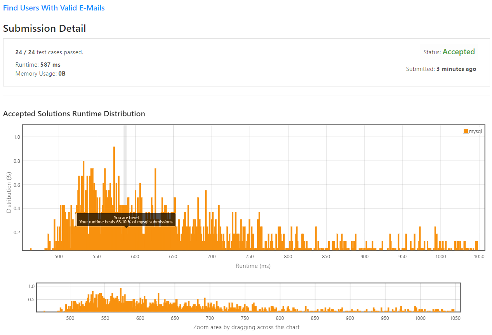

# Find Users With Valid E-Mails
Table: `Users`
```
+---------------+---------+
| Column Name   | Type    |
+---------------+---------+
| user_id       | int     |
| name          | varchar |
| mail          | varchar |
+---------------+---------+
user_id is the primary key for this table.
This table contains information of the users signed up in a website. Some e-mails are invalid.
```

Write an SQL query to find the users who have **valid emails**.

A valid e-mail has a prefix name and a domain where: 

* **The prefix** name is a string that may contain letters (upper or lower case), digits, underscore `'_'`, period `'.'` and/or dash `'-'`. The prefix name **must** start with a letter.
* The domain is `'@leetcode.com'`.

Return the result table in any order.

The query result format is in the following example

```
Users
+---------+-----------+-------------------------+
| user_id | name      | mail                    |
+---------+-----------+-------------------------+
| 1       | Winston   | winston@leetcode.com    |
| 2       | Jonathan  | jonathanisgreat         |
| 3       | Annabelle | bella-@leetcode.com     |
| 4       | Sally     | sally.come@leetcode.com |
| 5       | Marwan    | quarz#2020@leetcode.com |
| 6       | David     | david69@gmail.com       |
| 7       | Shapiro   | .shapo@leetcode.com     |
+---------+-----------+-------------------------+

Result table:
+---------+-----------+-------------------------+
| user_id | name      | mail                    |
+---------+-----------+-------------------------+
| 1       | Winston   | winston@leetcode.com    |
| 3       | Annabelle | bella-@leetcode.com     |
| 4       | Sally     | sally.come@leetcode.com |
+---------+-----------+-------------------------+
The mail of user 2 doesn't have a domain.
The mail of user 5 has # sign which is not allowed.
The mail of user 6 doesn't have leetcode domain.
The mail of user 7 starts with a period.
```
## My Solution 

```sql 
SELECT * 
FROM Users U 
WHERE U.mail regexp '^[A-Za-z]{1}[A-Za-z0-9\\.\\-_]*@leetcode.com$'
```

## My Submission 
