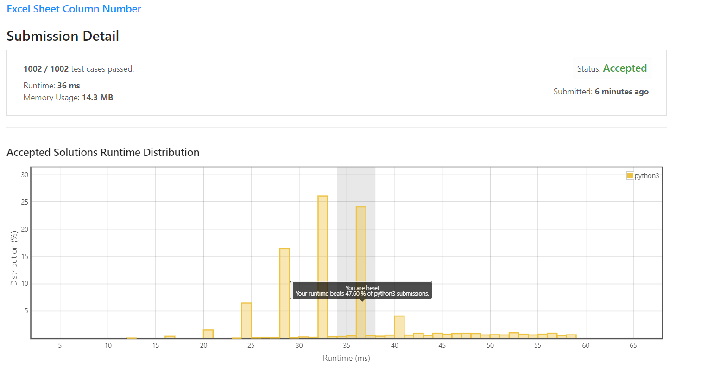

# 171. Excel Sheet Column Number

Given a string `columnTitle` that represents the column title as appear in an Excel sheet, return *its corresponding column number.*

For example:
```
A -> 1
B -> 2
C -> 3
...
Z -> 26
AA -> 27
AB -> 28 
...
```

**Example 1:**
```
Input: columnTitle = "A"
Output: 1
```

**Example 2:**
```
Input: columnTitle = "AB"
Output: 28
```

**Example 3:**
```
Input: columnTitle = "ZY"
Output: 701
```

**Example 4:**
```
Input: columnTitle = "FXSHRXW"
Output: 2147483647
```

**Constraints:**

* `1 <= columnTitle.length <= 7`
* `columnTitle` consists only of uppercase English letters.
* `columnTitle` is in the range ["A", "FXSHRXW"].

## My Solution 
```python
class Solution:
    def titleToNumber(self, columnTitle: str) -> int:
        ans = 0
        p = 0
        for i in range(len(columnTitle)):
            ans += (ord(columnTitle[i])-64) * (26 ** (len(columnTitle) - i -1))
        return ans
```

## My submission 



