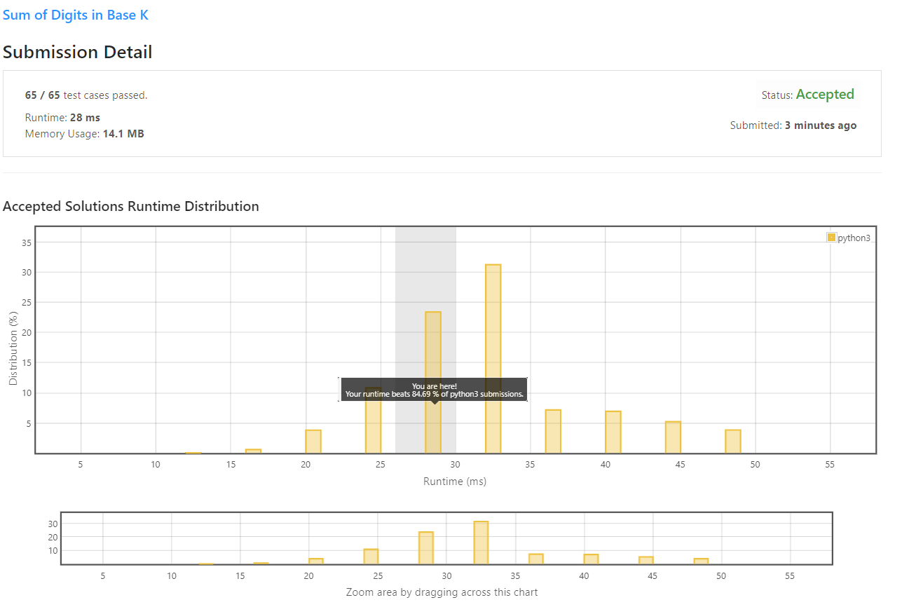

# Sum of Digits in Base K
Given an integer `n` (in base `10`) and `a` base `k`, return the **sum** of the digits of `n` **after** converting `n` from base `10` to base `k`.

After converting, each digit should be interpreted as a base `10` number, and the sum should be returned in base `10`.


**Example 1:**
```
Input: n = 34, k = 6
Output: 9
Explanation: 34 (base 10) expressed in base 6 is 54. 5 + 4 = 9.
```
**Example 2:**
```
Input: n = 10, k = 10
Output: 1
Explanation: n is already in base 10. 1 + 0 = 1.
```

**Constraints:**

* `1 <= n <= 100`
* `2 <= k <= 10`

My Solution 
```python
class Solution:
    def numberToBase(self,n, b):
        if n == 0:
            return [0]
        digits = []
        while n:
            digits.append(int(n % b))
            n //= b
        return digits[::-1]

    def sumBase(self, n: int, k: int) -> int:
        return sum(self.numberToBase(n,k))
```


## My Submission 

