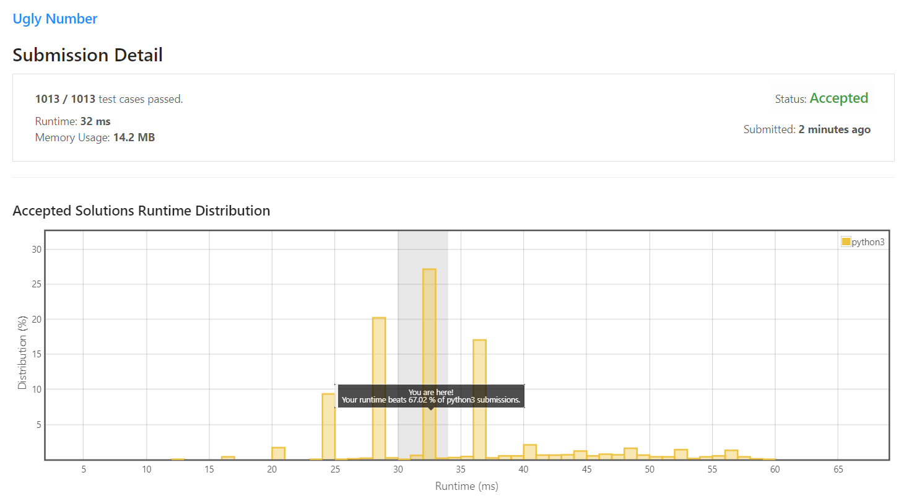

# 263. Ugly Number

An **ugly number** is a positive integer whose prime factors are limited to `2`,`3`, and `5`.

Given an integer `n`, return `true` if `n` is an **ugly number**.


**Example 1:**
```
Input: n = 6
Output: true
Explanation: 6 = 2 × 3
```
**Example 2:**
```
Input: n = 8
Output: true
Explanation: 8 = 2 × 2 × 2
```
**Example 3:**
```
Input: n = 14
Output: false
Explanation: 14 is not ugly since it includes the prime factor 7.
```
**Example 4:**
```
Input: n = 1
Output: true
Explanation: 1 has no prime factors, therefore all of its prime factors are limited to 2, 3, and 5.
 ```
**Constraints:**

* `-231 <= n <= 231 - 1`


## My solution 
```python
class Solution:
    def isUgly(self, n: int) -> bool:
        if n<1:
            return False
        
        while n % 2 == 0:
            n //= 2
            
        while n % 3 == 0:
            n //= 3
            
        while n % 5 == 0:
            n //= 5
            
        return n == 1 
```

## My submission 


