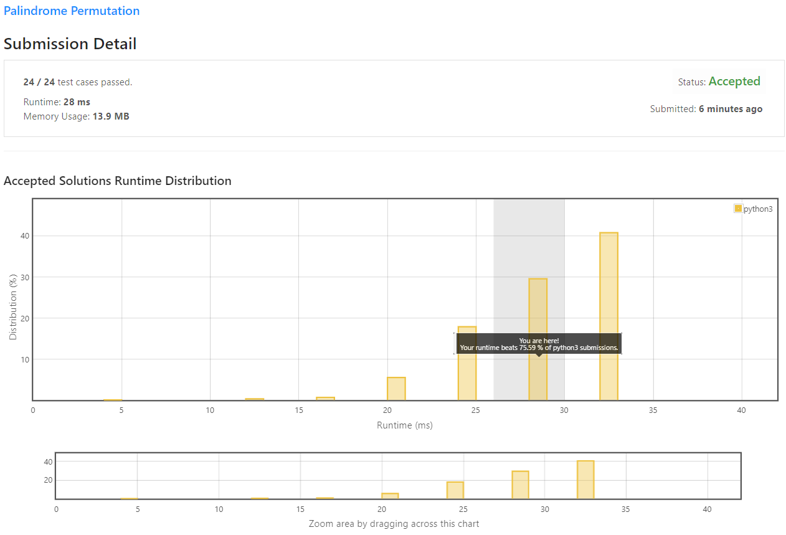

# Palindrome Permutation

Given a string `s`, return `true` if a permutation of the string could form a palindrome.

**Example 1:**
```
Input: s = "code"
Output: false
```

**Example 2:**
```
Input: s = "aab"
Output: true
```

**Example 3:**
```
Input: s = "carerac"
Output: true
```

**Constraints:**

* `1 <= s.length <= 5000`
* `s` consists of only lowercase English letters.

## My Solution 

Easiest solution to check Palindrome is by calculate how many times a character appear, then `Mod` 2.
If the `Mod 2` = `0` then it is possible to create `Palindrome` or at most there are only 1 character that appear in odd (`Mod 2` = 1)

**Note:** This is only possible for Palindrome Permutation

```python
class Solution:
    def canPermutePalindrome(self, s: str) -> bool:
        pal = 0
        for i in set(s): 
            pal += s.count(i)%2    
        return pal <= 1
```

## My Submission



