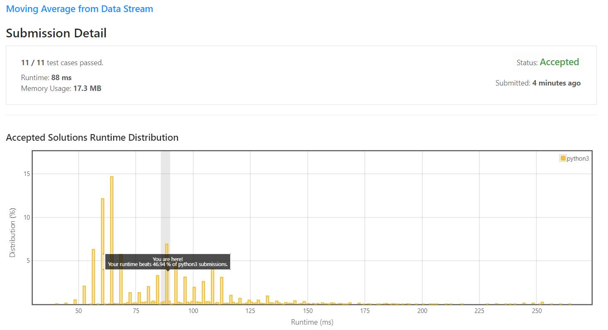

# 346. Moving Average from Data Stream

Given a stream of integers and a window size, calculate the moving average of all integers in the sliding window.

Implement the `MovingAverage` class:

* `MovingAverage(int size)` Initializes the object with the size of the window `size`.
* `double next(int val)` Returns the moving average of the last `size` values of the stream.


**Example 1:**
```
Input
["MovingAverage", "next", "next", "next", "next"]
[[3], [1], [10], [3], [5]]
Output
[null, 1.0, 5.5, 4.66667, 6.0]

Explanation
MovingAverage movingAverage = new MovingAverage(3);
movingAverage.next(1); // return 1.0 = 1 / 1
movingAverage.next(10); // return 5.5 = (1 + 10) / 2
movingAverage.next(3); // return 4.66667 = (1 + 10 + 3) / 3
movingAverage.next(5); // return 6.0 = (10 + 3 + 5) / 3
```
 

**Constraints:**

* `1 <= size <= 1000`
* -10<sup>5</sup> <= val <= 10<sup>5</sup>
* At most 10<sup>4</sup> calls will be made to next.

## My solution

```python
class MovingAverage:

    def __init__(self, size: int):
        """
        Initialize your data structure here.
        """
        self.w_size = size
        self.nums = []

    def next(self, val: int) -> float:
        if len(self.nums) == self.w_size:
            self.nums.pop(0)
            self.nums.append(val)
        else:
            self.nums.append(val)
            
        return sum(self.nums)/len(self.nums)
        
# Your MovingAverage object will be instantiated and called as such:
# obj = MovingAverage(size)
# param_1 = obj.next(val)
```

## My submission

