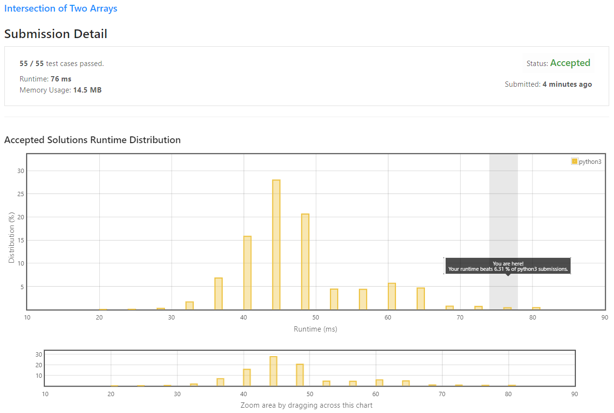
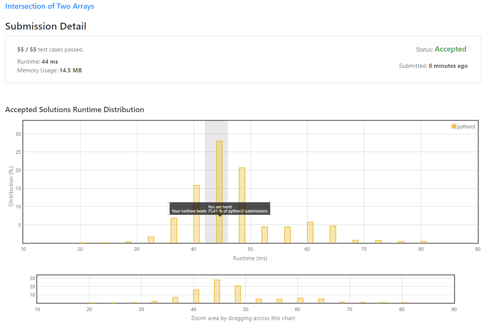

# Intersection of Two Arrays

Given two integer arrays `nums1` and `nums2`, return an array of their intersection. Each element in the result must be `unique` and you may return the result in any order.

**Example 1:**
```
Input: nums1 = [1,2,2,1], nums2 = [2,2]
Output: [2]
```

**Example 2:**
```
Input: nums1 = [4,9,5], nums2 = [9,4,9,8,4]
Output: [9,4]
Explanation: [4,9] is also accepted.
```

**Constraints:**

* `1 <= nums1.length, nums2.length <= 1000`
* `0 <= nums1[i], nums2[i] <= 1000`

## My Solution 
**Brute Force**

```python
class Solution:
    def intersection(self, nums1: List[int], nums2: List[int]) -> List[int]:
        n = min(len(nums1),len(nums2))
        out = []
        
        for i in range(n): 
            if (nums1[i] in nums2) and (nums1[i] not in out):
                out.append(nums1[i])
                
            if (nums2[i] in nums1) and (nums2[i] not in out):
                out.append(nums2[i])
        return out
```
**Two Set Intersection**

```python
class Solution:
    def intersection(self, nums1: List[int], nums2: List[int]) -> List[int]:
        return list(set(nums1) & set(nums2))
```
## My Submission 





