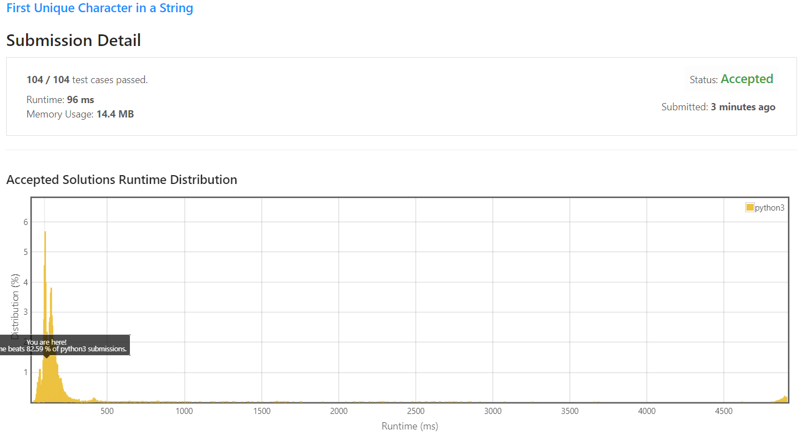

# 387. First Unique Character in a String

Given a string `s`, *find the first non-repeating character in it and return its index.* If it does not exist, return `-1`.

**Example 1:**
```
Input: s = "leetcode"
Output: 0
```

**Example 2:**
```
Input: s = "loveleetcode"
Output: 2
```

**Example 3:**
```
Input: s = "aabb"
Output: -1
```
 

**Constraints:**

* 1 <= s.length <= 10<sup>5</sup>
* `s` consists of only lowercase English letters.

## My solution 
`use python collections counter`

```python
class Solution:
    def firstUniqChar(self, s: str) -> int:
        counter_dic = collections.Counter(s)
        for i in range(len(s)): 
            if counter_dic[s[i]] == 1:
                return i
        return -1 
```

## My submission 

