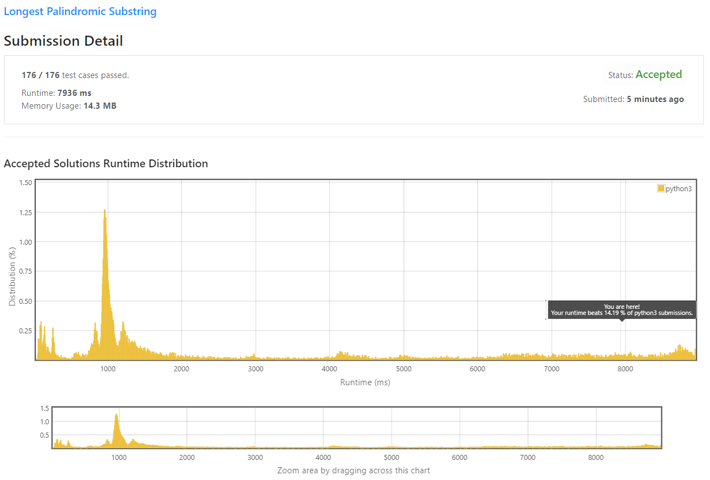

# Longest Palindromic Substring

Given a string `s`, return the longest palindromic substring in `s`.

**Example 1:**
```
Input: s = "babad"
Output: "bab"
Note: "aba" is also a valid answer.
```

**Example 2:**
```
Input: s = "cbbd"
Output: "bb"
```

**Example 3:**
```
Input: s = "a"
Output: "a"
```

**Example 4:**
```
Input: s = "ac"
Output: "a"
```
 

**Constraints:**

* `1 <= s.length <= 1000`
* `s` consist of only digits and English letters (lower-case and/or upper-case),

## My Solution 
I check the possible palindrome substring from the longest until shortest possible substring.

```python
class Solution:
    def longestPalindrome(self, s: str) -> str:
        if s == '':
            return ''
        
        num_s = len(s)
            
        while 1:
            start = 0
            end = start + num_s
            while end <= len(s):
                subst = s[start:end]
                if subst == subst[::-1]:
                    return subst
                
                start += 1
                end += 1
            
            num_s -=1
```

## My Submission 


