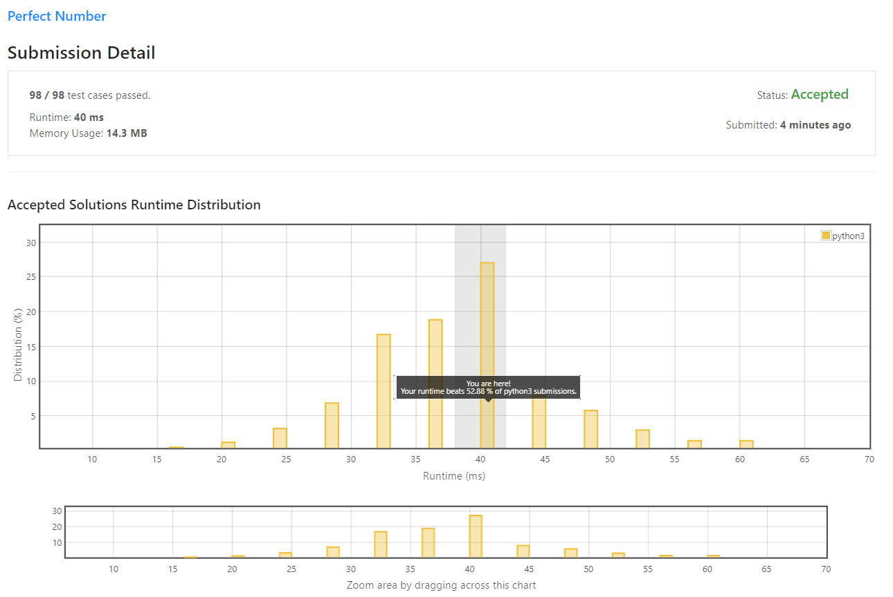

# Perfect Number

A **perfect number** is a **positive integer** that is equal to the sum of its **positive divisors**, excluding the number itself. A **divisor** of an integer `x` is an integer that can divide `x` evenly.

Given an integer `n`, return `true` if `n` is a perfect number, otherwise return `false`.

 

**Example 1:**
```
Input: num = 28
Output: true
Explanation: 28 = 1 + 2 + 4 + 7 + 14
1, 2, 4, 7, and 14 are all divisors of 28.
```

**Example 2:**
```
Input: num = 6
Output: true
```

**Example 3:**
```
Input: num = 496
Output: true
```

**Example 4:**
```
Input: num = 8128
Output: true
```

**Example 5:**
```
Input: num = 2
Output: false
```

**Constraints:**

* 1 <= num <= 10<sup>8</sup>

## My Solution 
```python
class Solution:
    def checkPerfectNumber(self, num: int) -> bool:
        if num < 3:
            return False
    
        fac = []
        m = num//2
        fac.append(1)
        i=2
        #sum_f = 1
        while i*i < num and i < m: 
            if num%i == 0: 
                fac.append(i)
                m = num//i
                #sum_f += (i+m)
                fac.append(m)
            i += 1
        #return sum_f == num
        return sum(fac)==num
```

## My Submission 


