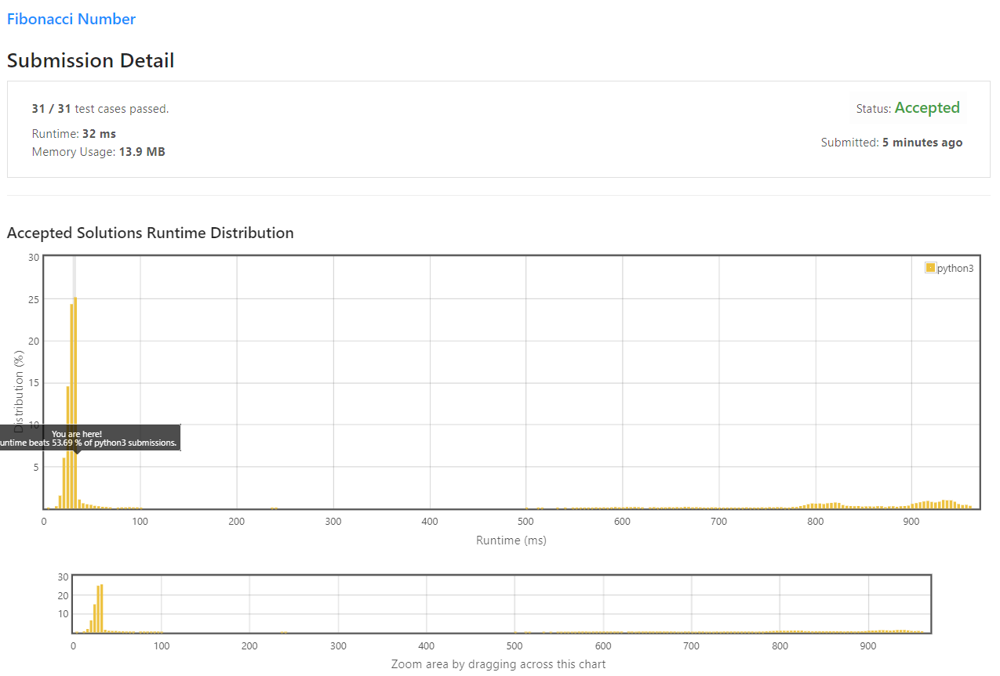

# Fibonacci Number

The **Fibonacci numbers**, commonly denoted `F(n)` form a sequence, called the **Fibonacci sequence**, such that each number is the sum of the two preceding ones, starting from `0` and `1`. That is,
```
F(0) = 0, F(1) = 1
F(n) = F(n - 1) + F(n - 2), for n > 1.
Given n, calculate F(n).
```

**Example 1:**
```
Input: n = 2
Output: 1
Explanation: F(2) = F(1) + F(0) = 1 + 0 = 1.
```

**Example 2:**
```
Input: n = 3
Output: 2
Explanation: F(3) = F(2) + F(1) = 1 + 1 = 2.
```

**Example 3:**
```
Input: n = 4
Output: 3
Explanation: F(4) = F(3) + F(2) = 2 + 1 = 3.
```
 

**Constraints:**

* `0 <= n <= 30`

## My Solution 
I used `Dynamic Programming`. Other approaches may use recursive. 

```python
class Solution:
    def fib(self, n: int) -> int:
        if n == 0: 
            return 0
        if n == 1: 
            return 1
        
        f = [0,1]
        for i in range(2,n+1):
            f += [f[i-1] + f[i-2]]
            
        return f[-1]
```

## My Submission 


