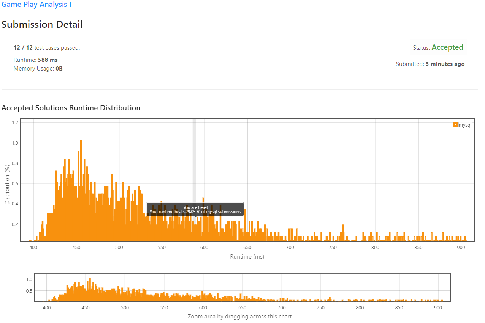

# Game Play Analysis I

Table: `Activity`
```
+--------------+---------+
| Column Name  | Type    |
+--------------+---------+
| player_id    | int     |
| device_id    | int     |
| event_date   | date    |
| games_played | int     |
+--------------+---------+
(player_id, event_date) is the primary key of this table.
This table shows the activity of players of some game.
Each row is a record of a player who logged in and played a number of games (possibly 0) before logging out on some day using some device.
``` 

Write an SQL query that reports the **first login date** for each player.

The query result format is in the following example:
```
Activity table:
+-----------+-----------+------------+--------------+
| player_id | device_id | event_date | games_played |
+-----------+-----------+------------+--------------+
| 1         | 2         | 2016-03-01 | 5            |
| 1         | 2         | 2016-05-02 | 6            |
| 2         | 3         | 2017-06-25 | 1            |
| 3         | 1         | 2016-03-02 | 0            |
| 3         | 4         | 2018-07-03 | 5            |
+-----------+-----------+------------+--------------+

Result table:
+-----------+-------------+
| player_id | first_login |
+-----------+-------------+
| 1         | 2016-03-01  |
| 2         | 2017-06-25  |
| 3         | 2016-03-02  |
+-----------+-------------+
```

## My Solution
```sql
SELECT DISTINCT player_id, MIN(event_date) as first_login 
FROM Activity A
GROUP BY player_id
ORDER BY A.player_id, A.event_date
```

## My Submission 

