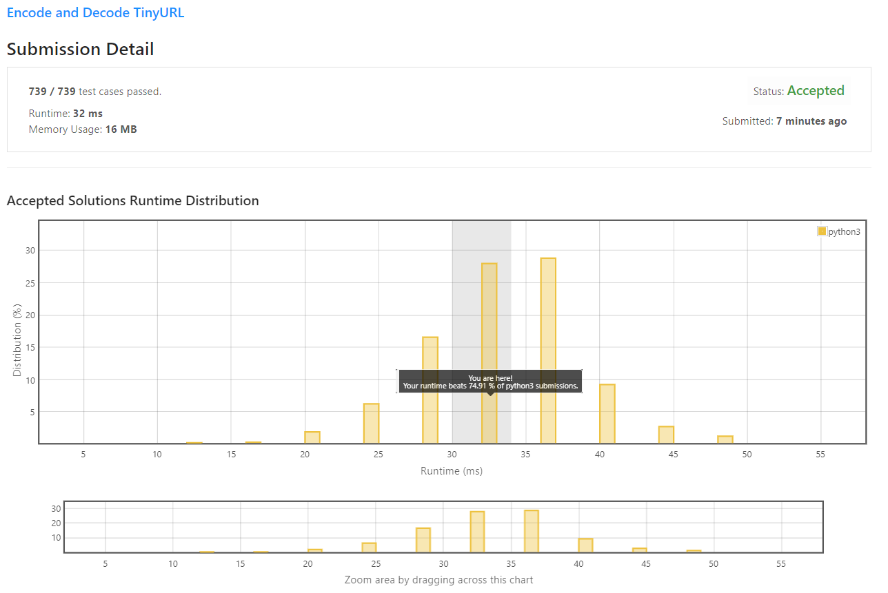

# Encode and Decode TinyURL

```
Note: This is a companion problem to the System Design problem: Design TinyURL.
```
TinyURL is a URL shortening service where you enter a URL such as `https://leetcode.com/problems/design-tinyurl` and it returns a short URL such as `http://tinyurl.com/4e9iAk`. Design a class to encode a URL and decode a tiny URL.

There is no restriction on how your encode/decode algorithm should work. You just need to ensure that a URL can be encoded to a tiny URL and the tiny URL can be decoded to the original URL.

Implement the `Solution` class:

* `Solution()` Initializes the object of the system.
* `String encode(String longUrl)` Returns a tiny URL for the given longUrl.
* `String decode(String shortUrl)` Returns the original long URL for the given `shortUrl`. It is guaranteed that the given `shortUrl` was encoded by the same object.
 

**Example 1:**
```
Input: url = "https://leetcode.com/problems/design-tinyurl"
Output: "https://leetcode.com/problems/design-tinyurl"

Explanation:
Solution obj = new Solution();
string tiny = obj.encode(url); // returns the encoded tiny url.
string ans = obj.decode(tiny); // returns the original url after deconding it.
``` 

**Constraints:**

* 1 <= `url.length` <= 10<sup>4</sup>
* `url` is guranteed to be a valid URL.


## My Solution 
For simplicity, I used `SHA` from `hashlib` and store in `Dictionary`. In real world application supposed to store in database. 

```python
import hashlib
import random 

class Codec:
    def __init__(self): 
        self.d = {}
        self.base_url = "http://tinyurl.com/"

    def encode(self, longUrl: str) -> str:
        """Encodes a URL to a shortened URL.
        """
        h = hashlib.sha256(str(random.getrandbits(256)).encode('utf-8')).hexdigest()
        self.d[self.base_url + h] = longUrl
        return self.base_url + h

    def decode(self, shortUrl: str) -> str:
        """Decodes a shortened URL to its original URL.
        """
        return self.d[shortUrl]
        

# Your Codec object will be instantiated and called as such:
# codec = Codec()
# codec.decode(codec.encode(url))
```

## My Submission 

