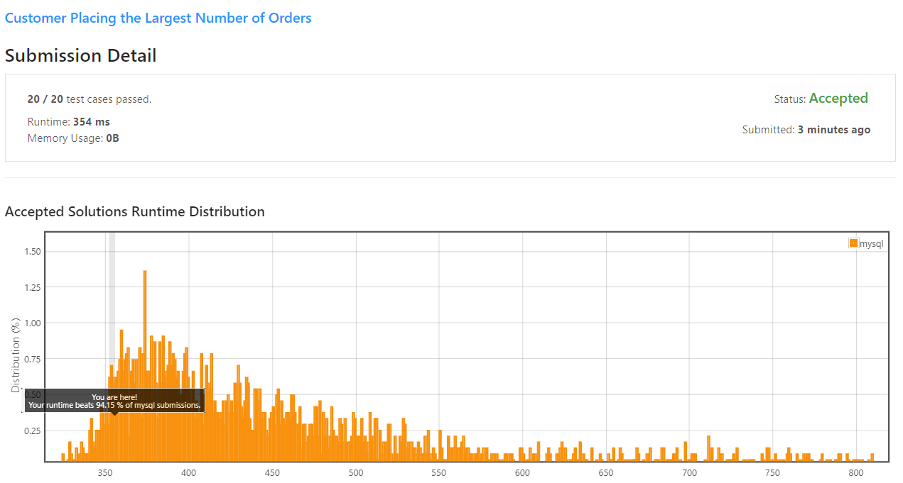

# Customer Placing the Largest Number of Orders

Table: `Orders`
```
+-----------------+----------+
| Column Name     | Type     |
+-----------------+----------+
| order_number    | int      |
| customer_number | int      |
+-----------------+----------+
order_number is the primary key for this table.
This table contains information about the order ID and the customer ID.
```

Write an SQL query to find the `customer_number` for the customer who has placed **the largest number of orders**.

It is **guaranteed** that exactly one customer will have placed more orders than any other customer.

The query result format is in the following example:

```
Orders table:
+--------------+-----------------+
| order_number | customer_number |
+--------------+-----------------+
| 1            | 1               |
| 2            | 2               |
| 3            | 3               |
| 4            | 3               |
+--------------+-----------------+

Result table:
+-----------------+
| customer_number |
+-----------------+
| 3               |
+-----------------+
The customer with number 3 has two orders, which is greater than either customer 1 or 2 because each of them only has one order. 
So the result is customer_number 3.
```


**Follow up:** What if more than one customer have the largest number of orders, can you find all the `customer_number` in this case?

## My Solution
```sql
SELECT A.customer_number
FROM (
	SELECT customer_number, COUNT(*) AS order_a
	FROM orders
	GROUP BY customer_number
	ORDER BY order_a DESC) AS A
LIMIT 1
```

## My Submission 


