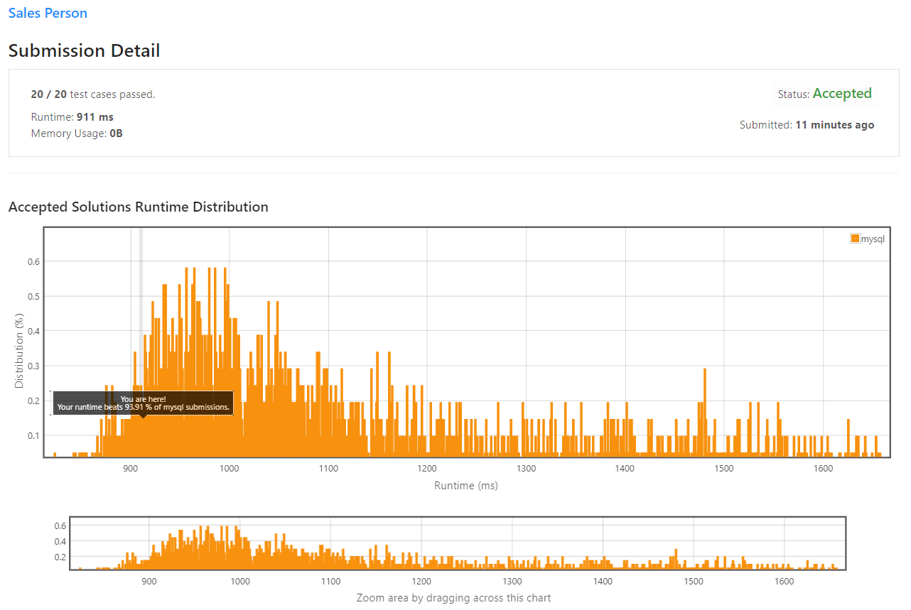

# Sales Person

**Description**

Given three tables: `salesperson`, `company`, `orders`.
Output all the **names** in the table `salesperson`, who didn’t have sales to company `'RED'`.

**Example**

**Input**

Table: `salesperson`
```
+----------+------+--------+-----------------+-----------+
| sales_id | name | salary | commission_rate | hire_date |
+----------+------+--------+-----------------+-----------+
|   1      | John | 100000 |     6           | 4/1/2006  |
|   2      | Amy  | 120000 |     5           | 5/1/2010  |
|   3      | Mark | 65000  |     12          | 12/25/2008|
|   4      | Pam  | 25000  |     25          | 1/1/2005  |
|   5      | Alex | 50000  |     10          | 2/3/2007  |
+----------+------+--------+-----------------+-----------+
```
The table `salesperson` holds the `salesperson` information. Every `salesperson` has a `sales_id` and a `name`.


Table: `company`
```
+---------+--------+------------+
| com_id  |  name  |    city    |
+---------+--------+------------+
|   1     |  RED   |   Boston   |
|   2     | ORANGE |   New York |
|   3     | YELLOW |   Boston   |
|   4     | GREEN  |   Austin   |
+---------+--------+------------+
```
The table company holds the company information. Every company has a `com_id` and a `name`.

Table: `orders`
```
+----------+------------+---------+----------+--------+
| order_id | order_date | com_id  | sales_id | amount |
+----------+------------+---------+----------+--------+
| 1        |   1/1/2014 |    3    |    4     | 100000 |
| 2        |   2/1/2014 |    4    |    5     | 5000   |
| 3        |   3/1/2014 |    1    |    1     | 50000  |
| 4        |   4/1/2014 |    1    |    4     | 25000  |
+----------+----------+---------+----------+--------+
```

The table `orders` holds the sales record information, `salesperson` and customer `company` are represented by `sales_id` and `com_id`.

**Output:**

```
+------+
| name | 
+------+
| Amy  | 
| Mark | 
| Alex |
+------+
```

**Explanation**

According to order `'3'` and `'4'` in table `orders`, it is easy to tell only `salesperson` `'John'` and `'Pam'` have sales to company `'RED'`,
so we need to output all the other names in the table `salesperson`.


## My Solution 

1. Select `sales_id` who has order with `RED` company
2. Select `name` from `salesperson` who are not in `query1`
```sql
SELECT name 
FROM salesperson S 
WHERE S.sales_id NOT IN (
	SELECT O.sales_id 
	FROM Orders O 
	WHERE O.com_id IN (
		SELECT com_id
		FROM company
		WHERE name = 'RED'
	)
)
```

## My Submission 


