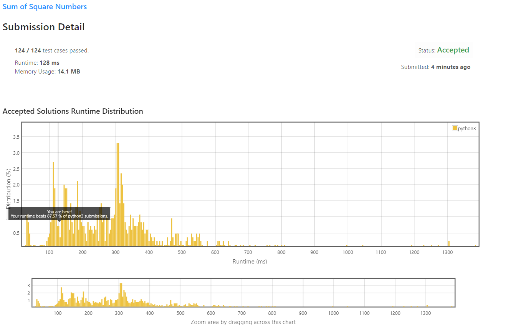

# Sum of Square Numbers

Given a non-negative integer `c`, decide whether there're two integers `a` and `b` such that a<sup>2</sup> + b<sup>2</sup> = c.

**Example 1:**
```
Input: c = 5
Output: true
Explanation: 1 * 1 + 2 * 2 = 5
```

**Example 2:**
```
Input: c = 3
Output: false
```

**Example 3:**
```
Input: c = 4
Output: true
```

**Example 4:**
```
Input: c = 2
Output: true
```

**Example 5:**
```
Input: c = 1
Output: true
 ```

**Constraints:**

* 0 <= c <= 2<sup>31</sup> - 1


## My solution 
Check if the complement number is integer
```python
class Solution:
    def judgeSquareSum(self, c: int) -> bool:
        if c==0 or c==1:
            return True
        for i in range(c): 
            if i*i > c:
                return False 
            if (sqrt(c-(i*i)).is_integer()):
                return True
        return False
```

## My Submission 



