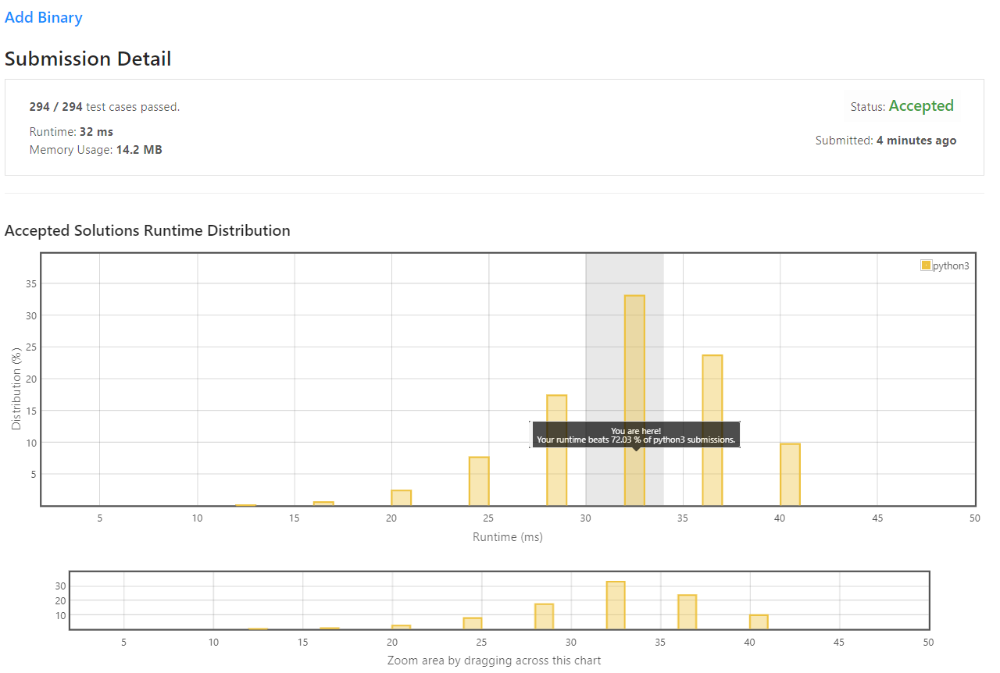

# Add Binary

Given two binary strings `a` and `b`, return *their sum as a binary string*.

**Example 1:**
```
Input: a = "11", b = "1"
Output: "100"
```
**Example 2:**
```
Input: a = "1010", b = "1011"
Output: "10101"
```
**Constraints:**

* 1 <= a.length, b.length <= 10<sup>4</sup>
* `a` and `b` consist only of `'0'` or `'1'` characters.
* Each string does not contain leading zeros except for the zero itself.

## My Solution 
1. Converted both number into decimal
2. added them together 
3. convert back to Binary 

```python
def addBinary(a: str, b: str) -> str:
    int_a = int(a,2) # Convert to Dec
    int_b = int(b,2)
    int_out = int_a + int_b # add
    
    out = bin(int_out)[2:] #convert back to binary
    return out
```

## My Submission 



 