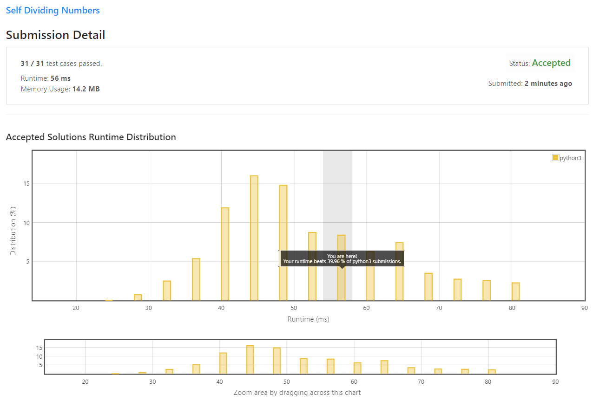

# Self Dividing Numbers

A *self-dividing number* is a number that is divisible by every digit it contains.

For example, 128 is a self-dividing number because `128 % 1 == 0`, `128 % 2 == 0`, and `128 % 8 == 0`.

Also, a self-dividing number is not allowed to contain the digit zero.

Given a lower and upper number bound, output a list of every possible self dividing number, including the bounds if possible.

**Example 1:**
```
Input: 
left = 1, right = 22
Output: [1, 2, 3, 4, 5, 6, 7, 8, 9, 11, 12, 15, 22]
```

**Note:**
* The boundaries of each input argument are `1 <= left <= right <= 10000`.

## My Solution

```python
class Solution:
    def checkSelfDiv(self,num:int)-> bool: 
        str_num = str(num)
        for i in range(len(str_num)):
            x = int(str_num[i])
            if x == 0:
                return False
                
            if num % x != 0:
                return False
        return True
            
    def selfDividingNumbers(self, left: int, right: int) -> List[int]:
        out = []
        for i in range(left,right+1): 
            if self.checkSelfDiv(i): 
                out.append(i)
        return out
```

## My Submission 


