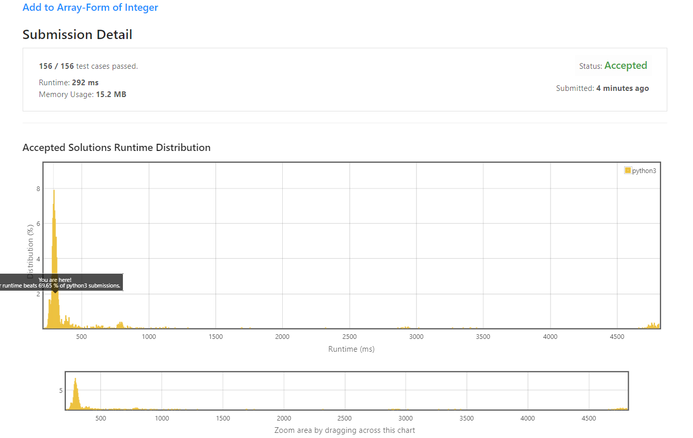

# Add to Array-Form of Integer

The **array-form** of an integer `num` is an array representing its digits in left to right order.

* For example, for `num = 1321`, the array form is `[1,3,2,1]`.
Given `num`, the **array-form** of an integer, and an integer `k`, return the **array-form** of the integer `num + k`.
  
**Example 1:**
```
Input: num = [1,2,0,0], k = 34
Output: [1,2,3,4]
Explanation: 1200 + 34 = 1234
```

**Example 2:**
```
Input: num = [2,7,4], k = 181
Output: [4,5,5]
Explanation: 274 + 181 = 455
```

**Example 3:**
```
Input: num = [2,1,5], k = 806
Output: [1,0,2,1]
Explanation: 215 + 806 = 1021
```

**Example 4:**
```
Input: num = [9,9,9,9,9,9,9,9,9,9], k = 1
Output: [1,0,0,0,0,0,0,0,0,0,0]
Explanation: 9999999999 + 1 = 10000000000
``` 

**Constraints:**

* 1 <= num.length <= 10<sup>4</sup>
* `0 <= num[i] <= 9`
* `num` does not contain any leading zeros except for the zero itself.
* 1 <= k <= 10<sup>4</sup>


## My Solution 
```python
class Solution:
    
    def Convert(self,string):
        list1=[]
        list1[:0]=string
        return list1

    def addToArrayForm(self, num: List[int], k: int) -> List[int]:
        str_num = ''
        for i in range(len(num)): 
            str_num += str(num[i])
            
        int_sum = int(str_num) + k 
        return self.Convert(str(int_sum))
```

## My Submission



